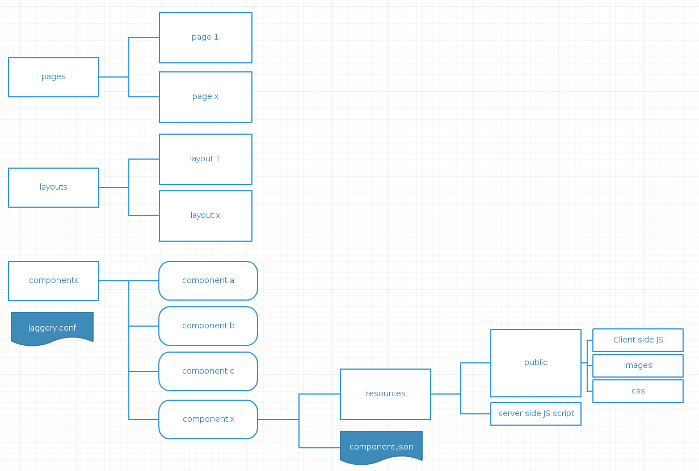
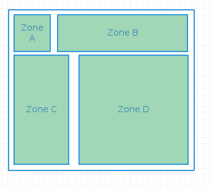
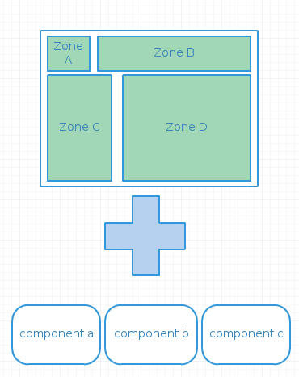
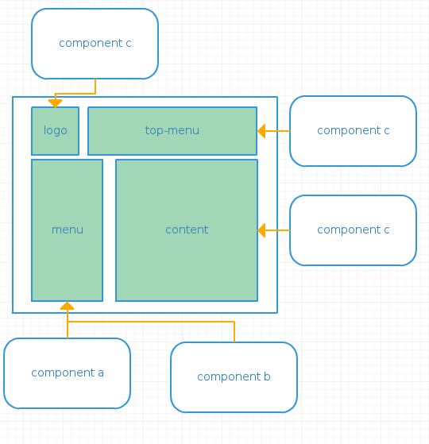

Prerequisites
=============
The Fuse or Unified UI Framework can be used to develop jaggery applications running within any WSO2 product containing the Jaggery runtime such
as the WSO2 Application Server.

Getting Started
===============
1. Clone this repo: https://github.com/manuranga/fuse.git
2. Change the name of the fuse folder to the name of your application
3. Select a WSO2 Product containing the Jaggery runtime such as WSO2 Application Server
4. Copy the folder to the
    {CARBON_PRODUCT_HOME}/repository/deployment/server/jaggeryapps directory
5. Navigate to https://localhost:9443/fuse/ (or if you have changed the name navigate to: https://localhost:9443/{your-app-name})

This repo doubles as both the framework repository as well as a sample.The framework source code is found in the libs folder while the rest of
the folders provide scaffolding for a sample application.

Elements of the framework
===========================
A Fuse application consists of three main components:

1. Layouts
2. Pages
3. Units (Components)

The following image shows the organization of the application structure in relation to the above components

###Layouts
A layout file describes the structure of a page and relative locations where UI elements can be plugged in.These UI elements are
defined as Units.

The layout defines the zones that can house content in the form of units (components).A zone is defined by the layout author.

A zone can be thaught of as areas where key pieces of content of a page reside.An example of this is shown in the figure below where zone A houses a logo and zone C houses a menu and so on.

###Pages
A page can be accessible by a url and most importantly marries a layout with a set of components.

###Units (Components)
A unit may encapsulate a set of business logic ,resources needed to render a UI element or resources required by an entire page.It is apt to think of units (components) as the building blocks of a page.
* Example of a unit providing resources to a page: https://github.com/manuranga/fuse/tree/master/units/bootstrap/public
* Example of a unit modeling an UI element: https://github.com/manuranga/fuse/tree/master/units/am-publisher-logo

The relationship between units (components) and a layout is highlighted below:

A unit (component) consists of four main elements:

####{unit-name}.json
Allows a unit (component) to inherit from another unit (component) by defining an extend property
Allows a scope (predicate) to be defined for the component by using the predicate property

####{unit-name}.js
When a unit (component) is loaded this script is executed and may contain server side initialization logic

####{unit-name}.hbs
Contains the UI representation as a Handlebars template.Please refer to  http://handlebarsjs.com/ for a detailed guide on working with the Handlebars syntax.

####public folder
Contains images,css and other resources neccessary to render a UI element

Tooling
=======
We have written a yeoman generator that will ease the creation of framework components such as pages, layouts and units (components).The generator-uuf
is available at: https://github.com/splinter/generator-uuf
